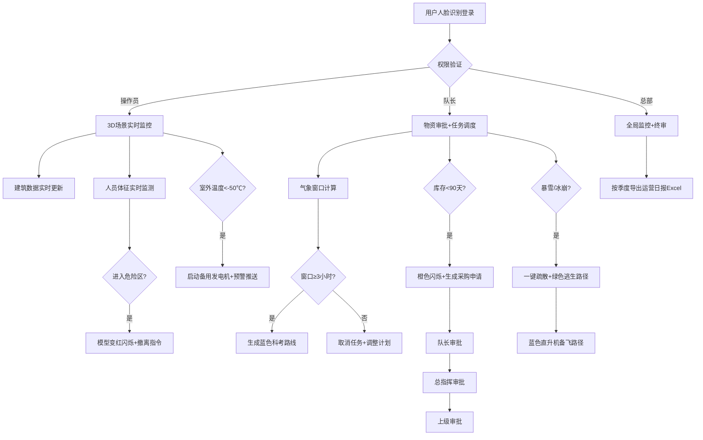

## 1. 产品概述
3D智慧极地科考站综合运营与应急调度可视化平台，基于数字孪生技术构建极地科考站三维虚拟场景，实现科考站全要素实时监控、智能调度与应急指挥。
- 主要解决极地科考站运营管理分散、应急响应迟缓、环境感知不足等问题，面向科考站管理人员、应急指挥人员、总部决策者
- 提升极地科考站运营效率、保障人员安全、降低能源消耗，实现科考站智能化、精细化管理

## 2. 核心功能

### 2.1 用户角色
| 角色 | 注册方式 | 核心权限 |
|------|----------|----------|
| 操作员 | 人脸识别登录 | 实时监控、数据查看、常规操作 |
| 考察队长 | 人脸识别登录 | 物资审批、任务调度、应急指挥 |
| 总部 | 人脸识别登录 | 全局监控、审批终审、数据导出 |

### 2.2 功能模块
1. **3D可视化主界面**：科考站全景三维场景、建筑模型、实时数据叠加
2. **建筑监控模块**：温湿度、能耗、设备状态实时显示，历史曲线查询
3. **人员定位模块**：队员位置追踪、生命体征监测、危险区域预警
4. **环境控制模块**：极夜模式自动调节、极端温度预警、备用电源启动
5. **气象调度模块**：天气预报、作业窗口计算、科考路线规划
6. **物资管理模块**：库存监控、预警提醒、三级审批流程
7. **应急指挥模块**：一键疏散、逃生路径显示、直升机备飞调度
8. **数据导出模块**：运营日报生成、Excel导出、季度统计分析

### 2.3 页面详情
| 页面名称 | 模块名称 | 功能描述 |
|----------|----------|----------|
| 登录页 | 人脸识别登录 | 摄像头采集人脸、三级权限验证、登录日志记录 |
| 3D主场景 | 全景可视化 | 科考站7类建筑3D模型、可交互点击、自由视角漫游 |
| 建筑详情弹窗 | 能耗与故障 | 24小时能耗曲线、温湿度趋势、设备故障记录、运行状态统计 |
| 人员监控面板 | 定位与体征 | 队员列表、实时心率/血氧、位置轨迹、危险区告警 |
| 气象调度中心 | 窗口计算 | 风速/温度/能见度预报、作业窗口分析、最优科考路线生成 |
| 物资管理中心 | 库存与审批 | 油料/食品/药品库存、采购申请、三级审批流转 |
| 应急指挥中心 | 疏散调度 | 一键疏散触发、绿色逃生路径、蓝色直升机备飞路径 |
| 数据导出中心 | 报表生成 | 按季度筛选、运营日报预览、Excel一键导出 |

## 3. 核心流程

## 4. 用户界面设计

### 4.1 设计风格
- 主色调：冰蓝色(#00D4FF)、极地白(#F0F8FF)、深空蓝(#0A1929)，营造极地科技感
- 辅助色：预警红(#FF4757)、安全绿(#2ED573)、警示橙(#FFA502)
- 字体：显示字体使用 Orbitron（科技感无衬线），正文字体使用 Noto Sans SC
- 布局：沉浸式3D场景为主界面，左右侧边栏悬浮信息面板，底部状态栏
- 交互风格：3D模型点击发光、数据面板毛玻璃效果、告警脉冲动画
- 图标：线性科技感图标，状态变化时带发光动效

### 4.2 页面设计概述
| 页面名称 | 模块名称 | UI元素 |
|----------|----------|--------|
| 登录页 | 人脸识别 | 全屏极地背景、摄像头取景框、人脸扫描动画、权限选择下拉框 |
| 3D主场景 | 全景可视化 | 全屏WebGL渲染、顶部导航栏、左侧建筑监控面板、右侧人员监控面板、底部状态栏 |
| 建筑详情弹窗 | 能耗与故障 | 毛玻璃卡片、Echarts折线图（24小时能耗）、故障记录时间轴、设备状态指示灯 |
| 人员监控面板 | 定位与体征 | 队员卡片列表、心率/血氧圆形仪表盘、位置轨迹动态连线、危险告警Banner |
| 气象调度中心 | 窗口计算 | 气象要素雷达图、作业窗口甘特图、3D场景蓝色科考路线轨迹 |
| 物资管理中心 | 库存与审批 | 库存进度条（低于阈值橙色闪烁）、审批流程时间线、三级审批按钮 |
| 应急指挥中心 | 疏散调度 | 红色告警全屏横幅、3D场景绿色逃生路径闪烁、蓝色直升机箭头动画 |
| 数据导出中心 | 报表生成 | 日期选择器、报表预览表格、导出进度条、下载按钮 |

### 4.3 响应性
- 桌面端优先设计，1920×1080及以上分辨率最佳体验
- 侧边栏支持折叠/展开，适配不同屏幕宽度
- 3D场景自适应窗口大小，支持鼠标/触屏操作
- 弹窗面板支持拖拽移动，避免遮挡关键3D视图

### 4.4 3D场景指导
- **环境/HDRI**：极地冰原环境，使用HDRI极地天空盒，支持极昼/极夜模式切换
- **光照设置**：极昼模式使用平行光模拟太阳光，极夜模式使用点光源模拟室内照明，色温从6500K渐变为2700K
- **相机设置**：默认第三人称俯视视角，支持环绕观察、平移、缩放，鼠标滚轮缩放、右键旋转
- **构图与焦点**：指挥中心位于场景中心，其他建筑围绕分布，冰裂隙危险区标注红色边界
- **交互与动画**：建筑hover高亮、click弹出详情面板、人员模型行走动画、直升机备飞旋转动画
- **后期处理**：Bloom泛光效果（极地冰雪反光）、屏幕空间环境光遮蔽、极夜模式轻微噪点
- **性能预算**：场景面数控制在10万以内，使用LOD技术，目标帧率60fps
