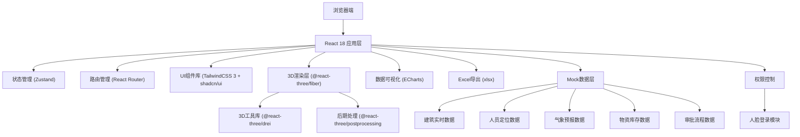
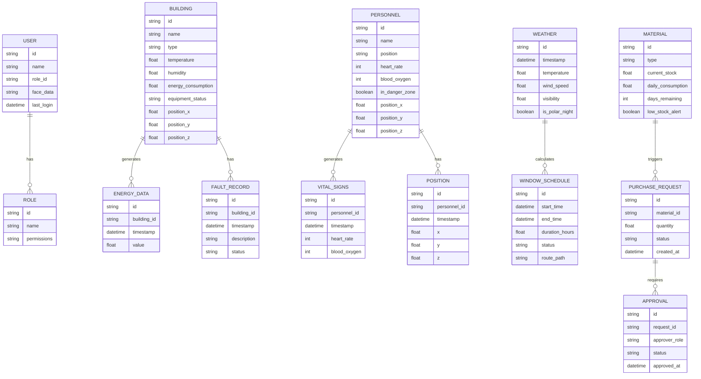

## 1. 架构设计

## 2. 技术描述
- **前端框架**: React@18.2.0 + TypeScript
- **构建工具**: Vite@5
- **3D引擎**: three@0.160.0 + @react-three/fiber@8.15
- **3D辅助**: @react-three/drei@9.92 + @react-three/postprocessing@2.15
- **样式方案**: TailwindCSS@3 + @tailwindcss/vite
- **UI组件**: shadcn/ui 组件库
- **状态管理**: Zustand@4.4
- **路由管理**: React Router@6.21
- **数据可视化**: ECharts@5.4
- **Excel导出**: xlsx@0.18.5
- **图标**: Lucide React
- **后端**: 无后端，使用Mock数据模拟实时数据流

## 3. 路由定义
| 路由 | 用途 |
|-------|------|
| /login | 人脸识别登录页 |
| /dashboard | 3D主场景（首页） |
| /buildings/:id | 建筑详情弹窗（嵌套路由） |
| /personnel | 人员监控中心 |
| /weather | 气象调度中心 |
| /materials | 物资管理中心 |
| /emergency | 应急指挥中心 |
| /export | 数据导出中心 |

## 4. 数据模型定义

## 5. 状态管理设计
### 5.1 Store 分层设计
- `useAuthStore`: 认证状态、用户信息、权限控制
- `useBuildingStore`: 建筑列表、实时数据、能耗历史、故障记录
- `usePersonnelStore`: 人员列表、实时体征、位置轨迹、危险区状态
- `useWeatherStore`: 气象数据、作业窗口、路线规划
- `useMaterialStore`: 物资库存、采购申请、审批流程
- `useSceneStore`: 3D场景状态、相机控制、极夜模式、应急状态

### 5.2 实时数据更新机制
- 采用 WebSocket 模拟实时数据流，每2秒更新一次建筑能耗、人员体征数据
- 气象数据每5分钟更新一次
- 人员位置每1秒更新一次

## 6. 核心组件设计
| 组件路径 | 组件名称 | 功能描述 |
|----------|----------|----------|
| `/src/components/Scene/Scene3D.tsx | 3D主场景容器 | Three.js场景渲染、相机控制、光照系统 |
| `/src/components/Scene/Building.tsx | 建筑模型组件 | 单个建筑3D模型、交互事件、数据标签 |
| `/src/components/Scene/PersonnelModel.tsx | 人员模型组件 | 队员3D模型、头顶信息牌、危险状态 |
| `/src/components/Scene/DangerZone.tsx | 危险区组件 | 冰裂隙区域渲染、碰撞检测 |
| `/src/components/Scene/RouteLine.tsx | 路线组件 | 科考路线、逃生路径、直升机路径 |
| `/src/components/UI/BuildingDetail.tsx | 建筑详情弹窗 | 24小时能耗曲线、故障记录 |
| `/src/components/UI/PersonnelPanel.tsx | 人员监控面板 | 队员列表、体征仪表盘 |
| `/src/components/UI/WeatherPanel.tsx | 气象调度面板 | 气象雷达图、作业窗口 |
| `/src/components/UI/MaterialPanel.tsx | 物资管理面板 | 库存监控、审批流程 |
| `/src/components/UI/EmergencyPanel.tsx | 应急指挥面板 | 一键疏散、路径显示 |
| `/src/components/UI/ExportPanel.tsx | 数据导出面板 | 报表预览、Excel导出 |
| `/src/components/Auth/LoginPage.tsx | 登录页 | 人脸识别、权限选择 |
| `/src/components/Layout/Sidebar.tsx | 侧边栏 | 功能导航、折叠展开 |
| `/src/components/Layout/TopBar.tsx | 顶部栏 | 用户信息、系统状态、退出登录 |
| `/src/components/Layout/StatusBar.tsx | 底部状态栏 | 实时气象、系统状态 |

## 7. 3D场景实现方案
### 7.1 建筑模型生成
- 使用基础几何体组合构建7类建筑模型（主楼、气象观测场、冰盖钻探点、物资仓库、发电站、直升机停机坪、指挥中心）
- 每个建筑使用 MeshStandardMaterial 材质，支持金属度、粗糙度调节
- 建筑底部添加发光边（EdgesGeometry）实现科技感轮廓
### 7.2 交互系统
- 使用 drei 的 useCursor 实现鼠标悬停光标变化
- 使用 raycaster 实现点击检测
- 建筑选中时添加 Emissive 材质高亮
### 7.3 动画系统
- 人员行走动画：使用简单的上下移动模拟行走
- 危险区闪烁：使用 useFrame 循环改变材质颜色
- 极夜模式过渡：使用 lerp 平滑过渡光照强度和色温
- 路线动画：使用 LineDashedMaterial + dashOffset 动画

## 8. 性能优化策略
- 3D场景：
  - 使用 InstancedMesh 批量渲染相似物体
  - 实现 LOD (Level of Detail) 层级细节
  - 材质复用、几何体合并
  - 后期效果按需开启
- React性能：
  - 使用 React.memo 避免不必要重渲染
  - Zustand selectors 精确订阅状态
  - 图表数据 useTransition 处理大量数据更新
  - 路由懒加载减少首屏体积

## 9. Mock 数据初始化
- 在 `/src/mock/` 目录下按模块组织 Mock 数据
- 使用 setInterval 模拟实时数据更新
- 数据结构与真实业务逻辑（温度、能耗、人员体征等数据随机波动

## 10. 构建与部署
- 开发命令：`npm run dev`
- 构建命令：`npm run build`
- 类型检查：`npm run typecheck`
- 代码规范：ESLint + Prettier
